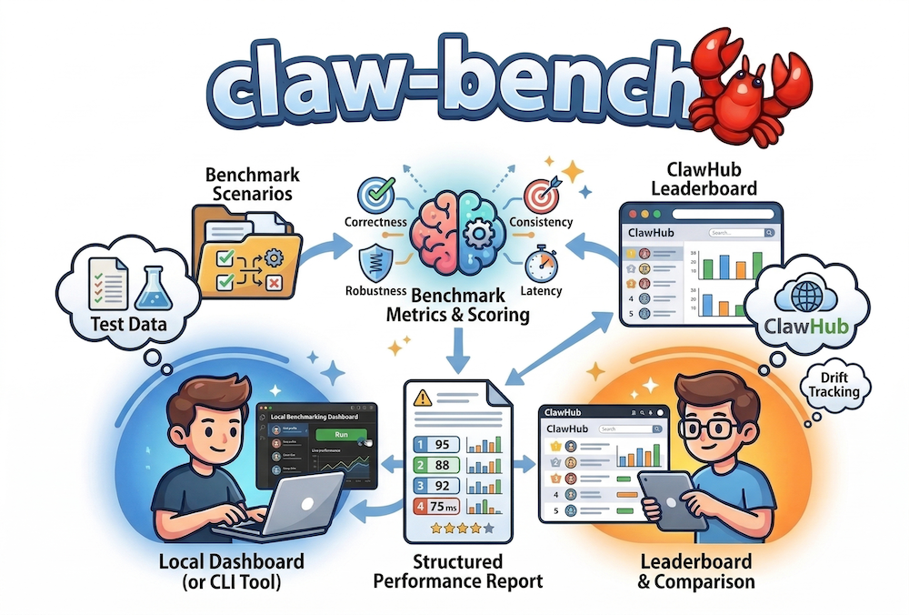

<div align="center">
  
  <h1>claw-bench</h1>
  <p><strong>Benchmark ClawHub skills — correctness, consistency, robustness, latency</strong></p>
  <p>
    Benchmark tool for <a href="https://clawhub.ai">ClawHub</a> skills. Scores skills on four dimensions — <strong>correctness</strong>, <strong>consistency</strong>, <strong>robustness</strong>, and <strong>latency</strong> — and produces structured reports for comparison, leaderboard submission, and drift tracking.
  </p>
  <p>
    The public registry website is <a href="https://clawhub.ai"><strong>clawhub.ai</strong></a> (skills: <a href="https://clawhub.ai/skills">clawhub.ai/skills</a>). The <code>clawhub.dev</code> hostname is not the live ClawHub site; <code>api.clawhub.dev</code> often does not resolve in DNS—set <code>CLAWHUB_API_URL</code> yourself when ClawHub documents a working benchmark endpoint.
  </p>
  <p>
    <a href="https://github.com/just-claw-it/claw-bench/actions/workflows/ci.yml?branch=main">
      
    </a>
    <a href="LICENSE">
      
    </a>
  </p>
</div>

## Installation

The package is **not on the npm registry yet** — clone this repository and run `npm install && npm run build`, or use `npm link` from the repo root (see [Development](#development)). When it is published, you will be able to use:

```bash
npm install -g claw-bench
```

Or install locally in a project:

```bash
npm install claw-bench
```

### Prerequisites

- **Node.js 20+**
- **Ollama** running locally (for consistency scoring via embeddings). Pull an embedding model:
  ```bash
  ollama pull nomic-embed-text
  ```

### Running from this repository (`command not found: claw-bench`)

The `claw-bench` command is only on your shell `PATH` if you install the package globally (`npm install -g claw-bench`) or link it (`npm link` inside this repo). When you clone the repo and run `claw-bench` directly, your shell may report **command not found**.

From the project root, build once, then use one of these:

```bash
npm install
npm run build
```

- **`npx claw-bench <args>`** — runs the local CLI (e.g. `npx claw-bench clawhub list`, `npx claw-bench dashboard --port 3078`).
- **`npm run clawhub -- <args>`** — same as `node dist/cli.js clawhub <args>` (e.g. `npm run clawhub -- list`, `npm run clawhub -- download --all`).
- **`npm run dashboard -- --port 3078`** — starts the dashboard on a free port if `3077` is busy.

Optional: `npm link` in the repo adds `claw-bench` to your PATH for this machine.

### Docker

Build and run the dashboard + API anywhere:

```bash
docker compose up --build
# http://localhost:3077
```

- **SQLite** is stored on the **`clawbench-data`** volume at **`CLAW_BENCH_DB=/data/bench.db`** (survives container restarts).
- The HTTP server binds **`0.0.0.0`** by default so published ports work; set **`CLAW_BENCH_BIND`** (e.g. `127.0.0.1`) to override.
- **`NODE_ENV=production`** (set in the image) hides local smoke-test runs (e.g. `test-skills/echo-skill`) from dashboard API responses. Set **`CLAW_BENCH_SHOW_TEST_RUNS=1`** in the container environment if you want them listed.
- The image ships an **empty** `clawhub/skills-seed.json` (`[]`). Populate the catalog by **exec**’ing into the container, or **bind-mount** seed and optionally `clawhub/zip/` for downloads.

```bash
docker compose exec claw-bench node dist/cli.js clawhub crawl --dry-run
docker compose exec claw-bench node dist/cli.js clawhub crawl
```

Mount examples in `docker-compose.yml`:

```yaml
volumes:
  - ./clawhub/skills-seed.json:/app/clawhub/skills-seed.json:ro
  # optional: persist downloaded zips
  - ./clawhub/zip:/app/clawhub/zip
```

Plain **Docker** (no Compose): `docker build -t claw-bench .` then  
`docker run -p 3077:3077 -v clawbench-data:/data claw-bench`.

### ClawHub: crawl, download, analyze

Registry data comes from the same Convex API as [clawhub.ai/skills](https://clawhub.ai/skills) (`skills:listPublicPageV4`), not HTML scraping.

**Crawl** (after `npm run build`):

```bash
npx claw-bench clawhub crawl
npx claw-bench clawhub crawl --dry-run
npx claw-bench clawhub crawl --seed-only
npx claw-bench clawhub crawl --sort stars
```

**Download** — saves zips under **`clawhub/zip/`** (legacy zips in `clawhub/` are moved there on the next `download --all`). Existing non-empty zips are skipped; failed slugs succeed on re-run. Rate limits (HTTP 429) use `Retry-After` and backoff; tune parallelism with **`CLAWHUB_DOWNLOAD_CONCURRENCY`** (default `1`).

**Analyze** — extracts to `clawhub-skills/<slug>/`, static + optional **`--llm`**. **`--cleanup`** drops zip + extract after each skill. Unless **`--no-seed`**, analyze **re-syncs the full seed into SQLite** first (like crawl/download) so `zip_path` matches disk—skip that when you already ran those steps and want to avoid a long upsert pass.

By default each run **appends** new rows to **`clawhub_analysis`**; it does **not** remove older results. Use **`--clean-analysis`** to wipe prior rows first: **full table** `DELETE` when the run covers the **entire** seed list (e.g. `analyze` with no slug, or any case where every seed is in scope); otherwise only **`DELETE` for the slugs** in that run (e.g. `analyze my-skill --clean-analysis`). Catalog rows in **`clawhub_skills`** and zips are unchanged.

```bash
npx claw-bench clawhub download --all
npx claw-bench clawhub analyze --all --no-seed
npx claw-bench clawhub analyze --all --llm --no-seed
# Wipe all prior analysis rows, then re-analyze from scratch (same LLM model ok without --force)
npx claw-bench clawhub analyze --all --llm --no-seed --clean-analysis
# CLAWHUB_LLM_PROVIDER=ollama OLLAMA_ANALYSIS_MODEL=llama3.1:8b npx claw-bench clawhub analyze --all --llm --no-seed
# npx claw-bench clawhub analyze --all --cleanup
```

**Analyze timing** — For each skill that runs through analyze, the CLI prints a **`time:`** line with millisecond breakdowns: **`extract`** (unzip into `clawhub-skills/`, or `0` if already extracted), **`static`** (five static checks + composite), **`llm`** (or `n/a` without `--llm`), **`fileStats`** (tree scan), **`pipeline`** (full `analyzeSkill()` wall time), and **`total`** (`extract` + `pipeline`).

The same numbers are persisted on **each insert** into SQLite table **`clawhub_analysis`**:

| Column | Meaning |
|--------|---------|
| `extract_ms` | Unzip / prepare extracted folder |
| `static_analysis_ms` | Static analyzers only |
| `llm_ms` | LLM call when `--llm` (SQL `NULL` when not used) |
| `file_stats_ms` | `collectFileStats` |
| `pipeline_ms` | Entire `analyzeSkill()` run |

Database file: **`CLAW_BENCH_DB`** (default **`~/.claw-bench/bench.db`**). Existing databases get these columns via migration on next open. The **ClawHub Catalog** dashboard does not show timing yet; use the CLI output or query SQLite (e.g. `SELECT slug, analyzed_at, extract_ms, pipeline_ms FROM clawhub_analysis ORDER BY id DESC LIMIT 20`).

**Re-run / backfill timing and scores** — Each `clawhub analyze` **inserts a new row**; nothing is updated in place unless you pass **`--clean-analysis`**. The catalog and dashboard use the **latest row per skill** (by `analyzed_at`), so older rows (including those with `NULL` timing columns from before timing existed) are **ignored** for display once a newer analysis exists.

1. Run analyze again as usual, e.g. `npx claw-bench clawhub analyze --all --llm --no-seed` (keeps history; newest row wins).
2. To **drop old analysis rows before the run**, add **`--clean-analysis`** (see above). After a full-table clean, **`--force`** is not required to re-run LLM on the same model (there is no prior row to skip).
3. If you use **`--llm`** **without** **`--clean-analysis`**, add **`--force`** when you want to **append** another evaluation for skills that already have a row for the **same** LLM model.
4. Manual SQL (backup first) still works if you prefer: `DELETE FROM clawhub_analysis;` or per-slug `DELETE FROM clawhub_analysis WHERE slug = 'my-skill';`

`npx claw-bench clawhub status` — zips vs seed vs analyzed counts.

**LLM provider for `clawhub analyze --llm`** (`CLAWHUB_LLM_PROVIDER`):

| Provider | Environment |
|----------|-------------|
| **Anthropic** (default when `ANTHROPIC_API_KEY` is set) | `ANTHROPIC_API_KEY`, optional `ANTHROPIC_MODEL` |
| **Ollama** | `CLAWHUB_LLM_PROVIDER=ollama`, `OLLAMA_HOST` (default `http://127.0.0.1:11434`), `OLLAMA_ANALYSIS_MODEL` or `OLLAMA_MODEL` |
| **OpenAI-compatible** (OpenAI, LM Studio, vLLM, etc.) | `CLAWHUB_LLM_PROVIDER=openai`, `OPENAI_API_KEY`, `OPENAI_BASE_URL` (optional), `OPENAI_MODEL` |

Embeddings for benchmarks still use **Ollama** via `OLLAMA_HOST` and `BENCH_EMBED_MODEL` — separate from catalog LLM analysis.

#### Catalog composite score (static + LLM)

Overall score blends **static** (deterministic checks on the skill tree) and optional **LLM** (rubric on `SKILL.md`):  
`overall = w_static × static_composite + w_llm × llm_composite` with defaults **`CLAWHUB_OVERALL_STATIC_WEIGHT=0.6`** and **`CLAWHUB_OVERALL_LLM_WEIGHT=0.4`** (normalized to sum to 1).

Re-run **`analyze --llm`** with different models to accumulate judges; the dashboard/catalog use the **latest row per model**, then combine dimensions with **`CLAWHUB_LLM_AGGREGATE`**: `mean` (default), `median`, `min`, `max`.

There is **no human-judge** path in this tool; use LLM + static scores for triage, not as a substitute for human review where it matters.

#### Catalog analyze: what each score means

`clawhub analyze` scores the **skill package as shipped** (files under the zip). That is **separate** from `claw-bench run`, which scores **runtime behavior** (correctness, consistency, robustness, latency). Catalog scores are best for **discovery and triage**: which skills look documented, safe, and complete enough to download and benchmark properly. A high catalog score does not mean the skill passes `bench.json`; a low score is a signal to fix docs or security before trusting the skill in production.

**Static analysis** (always on) produces five dimensions (each 0–1) and a **static composite** — a weighted sum:

| When script files exist (`.sh` / `.py` / `.js` / `.ts`) | Weight in static composite |
|----------------------------------------------------------|----------------------------|
| **doc** (documentation quality) | 30% |
| **complete** (completeness) | 20% |
| **security** | 25% |
| **code** (code quality) | 15% |
| **maintain** (maintainability) | 10% |

If there are **no** such script files, **code** is omitted (`n/a` in the log) and its 15% is **redistributed** across the others: **doc** 35%, **complete** 24%, **security** 29%, **maintain** 12%.

What each static dimension checks (heuristic, not a formal proof):

| Dimension | What it approximates | Why it matters for benchmarking |
|-----------|----------------------|----------------------------------|
| **doc** | `SKILL.md`: YAML frontmatter (`name`, `description`), length, headings, fenced code blocks, usage/install sections, examples, tables. | Agents and humans follow `SKILL.md`; weak docs make correctness runs harder to interpret and increase misuse. |
| **complete** | Presence of `SKILL.md`, `_meta.json`, semver-like version from registry metadata, scripts/hooks on disk when the doc references them, `references`/`assets`, multiple languages in the tree. | Missing files or version chaos suggest incomplete packages and flaky reproducibility. |
| **security** | Scans `.sh`, `.py`, `.js`, `.ts`, `.rb`, `.pl`, `.md` for dangerous patterns (e.g. `rm -rf /`, pipe-to-shell), obvious secret-like literals, and some exfiltration-style APIs; score drops per hit. | Skills run in real environments; static signals catch obvious foot-guns before you execute them. **Many issues will be missed** — this is triage, not an audit. |
| **code** | For each script: shebang / `set -e` / try-catch, comments, reasonable size, CLI help patterns; bonus for `scripts/` or `hooks/` layout. | Executable quality correlates with predictable behavior under `claw-bench run`. |
| **maintain** | Registry version count, file count and root layout, extra docs folders, download count as a weak popularity proxy. | Frequently updated, bounded packages are easier to track over time (drift, regressions). |

**LLM analysis** (`--llm`) reads `SKILL.md` (truncated for the prompt) and asks the model for four rubric scores (0–1), **equally weighted** in **llm composite** (simple average):

| Dimension | Rubric (from the evaluator prompt) | Why it matters for benchmarking |
|-----------|--------------------------------------|----------------------------------|
| **clarity** | Clear structure; an agent could follow without confusion. | Reduces ambiguous instructions that break consistency or robustness tests. |
| **usefulness** | Practical value; solves a real problem. | Separates placeholder skills from ones worth benchmarking. |
| **safety** | Credentials handling; dangerous operations and safeguards. | Overlaps *conceptually* with static **security** but judges prose and intent; still not a substitute for review. |
| **complete** (LLM) | Gaps in install, usage, errors, edge cases. | Complements static **complete** (file checks) with narrative coverage. |

LLM scores are **subjective** and model-dependent; use several models and `CLAWHUB_LLM_AGGREGATE` if you want a stabler signal.

**Overall** catalog score (dashboard / composite): blends **static composite** and **aggregated LLM composite** with `CLAWHUB_OVERALL_STATIC_WEIGHT` / `CLAWHUB_OVERALL_LLM_WEIGHT` (default **60% / 40%**). Without `--llm`, overall equals the static composite for that run.

Override the Convex deployment URL if ClawHub moves (rare):

| Variable | Description | Default |
|----------|-------------|---------|
| `CLAWHUB_CONVEX_URL` | Convex **.cloud** URL for `/api/query` | `https://wry-manatee-359.convex.cloud` |

## Quick start

```bash
# Benchmark a local skill
claw-bench run ./my-skill

# Benchmark a skill by name (looks in ./skills, ~/.clawhub/skills, etc.)
claw-bench run my-skill

# Compare two skills side-by-side
claw-bench compare ./skill-a ./skill-b

# View the last report as markdown
claw-bench report --format md

# Push results to the ClawHub leaderboard
claw-bench push --api-key <key>
```

## Scoring dimensions

| Dimension | Weight (authored) | Weight (automated) | Description |
|-----------|------------------:|-------------------:|-------------|
| Correctness | 40% | — | Passes input/output pairs from `bench.json` |
| Consistency | 30% | 50% | Embedding similarity across repeated runs |
| Robustness | 20% | 35% | Graceful handling of malformed inputs |
| Latency | 10% | 15% | p95 response time vs threshold |

If a skill ships with `bench.json`, it receives an **authored** score (all four dimensions). Otherwise, it gets an **automated** score (consistency + robustness + latency).

## CLI commands

### `claw-bench run <skill>`

Run a full benchmark on a skill.

| Flag | Description | Default |
|------|-------------|---------|
| `--threshold <n>` | Consistency similarity threshold | `0.92` |
| `--runs <n>` | Number of consistency/latency runs | `5` |
| `--latency-threshold <ms>` | Latency p95 threshold | `5000` |
| `--embed-model <model>` | Ollama embedding model | `nomic-embed-text` |
| `--semantic-check` | Run experimental LLM semantic check | off |
| `--skill-version <v>` | Tag run with a version for drift tracking | — |
| `--no-store` | Skip writing to local DB | — |
| `--output-dir <dir>` | Report output directory | `./bench-reports` |

### `claw-bench compare <skillA> <skillB>`

Side-by-side benchmark comparison. Accepts the same `--threshold`, `--runs`, `--latency-threshold`, and `--embed-model` flags as `run`.

### `claw-bench report`

Export or display an existing benchmark report.

| Flag | Description | Default |
|------|-------------|---------|
| `--format <fmt>` | `json` or `md` | `json` |
| `--input <file>` | Path to report | `./bench-reports/benchmark-report.json` |

### `claw-bench push`

Push a report to the ClawHub leaderboard.

| Flag | Description |
|------|-------------|
| `--api-key <key>` | ClawHub API key (or set `CLAWHUB_API_KEY`) |
| `--api-url <url>` | Override API endpoint |
| `--skill-name <n>` | Override skill name on leaderboard |
| `--draft` | Submit as draft (not publicly visible) |

### `claw-bench data <subcommand>`

Query the local benchmark database for analytics.

| Subcommand | Description |
|------------|-------------|
| `stats` | DB location and run count |
| `distribution` | Score distributions by skill type |
| `threshold` | Calibrate consistency threshold |
| `installs` | Score vs install count correlation |
| `drift [skill]` | Score drift over time |
| `authors` | Score by author verification status |
| `tags` | Mean score per tag |
| `stars` | Score vs star rating correlation |
| `deps` | Score vs dependency count |
| `growth` | Install growth vs score |
| `import-metadata <file>` | Import skill metadata from JSON |

## Configuration

### Environment variables

| Variable | Description | Default |
|----------|-------------|---------|
| `BENCH_EMBED_MODEL` | Default embedding model | `nomic-embed-text` |
| `OLLAMA_HOST` | Ollama server URL | `http://localhost:11434` |
| `CLAW_BENCH_DB` | SQLite database path | `~/.claw-bench/bench.db` |
| `CLAWHUB_API_KEY` | ClawHub leaderboard API key | — |
| `CLAWHUB_API_URL` | ClawHub benchmark leaderboard `POST` URL | `https://api.clawhub.dev/v1/leaderboard` (legacy default; **override** if that host does not resolve) |
| `CLAWHUB_CONVEX_URL` | Convex `.cloud` base URL for registry crawl (`clawhub crawl`) | `https://wry-manatee-359.convex.cloud` |
| `ANTHROPIC_API_KEY` | API key for semantic check / catalog LLM | — |
| `ANTHROPIC_MODEL` | Model for semantic check / catalog LLM | `claude-haiku-4-5-20251001` |
| `CLAWHUB_LLM_PROVIDER` | Catalog LLM: `anthropic` \| `ollama` \| `openai` | — |
| `OLLAMA_ANALYSIS_MODEL` | Ollama model for catalog `--llm` | same as `OLLAMA_MODEL` or `llama3.2` |
| `OPENAI_API_KEY` | OpenAI-compatible `chat/completions` for catalog `--llm` | — |
| `OPENAI_BASE_URL` | OpenAI-compatible API base | `https://api.openai.com/v1` |
| `OPENAI_MODEL` | OpenAI-compatible model id | `gpt-4o-mini` |
| `CLAWHUB_OVERALL_STATIC_WEIGHT` | Catalog overall: weight on **static** composite (with LLM) | `0.6` |
| `CLAWHUB_OVERALL_LLM_WEIGHT` | Catalog overall: weight on **aggregated LLM** composite | `0.4` |
| `CLAWHUB_LLM_AGGREGATE` | How to merge multiple LLM models: `mean` \| `median` \| `min` \| `max` | `mean` |
| `CLAWHUB_DOWNLOAD_CONCURRENCY` | Parallel `clawhub download` workers (lower reduces HTTP 429) | `1` |

Local artifacts (`clawhub/zip/`, `clawhub-skills/`, large `skills-seed.json`, `bench.db`) are **not** meant to be committed—see `.gitignore`.

## Writing `bench.json`

To enable correctness scoring, create a `bench.json` alongside `skill.json`:

```json
{
  "skillName": "my-skill",
  "pairs": [
    {
      "description": "Echoes input",
      "input": { "input": "hello" },
      "expectedOutput": { "echo": "hello" }
    }
  ]
}
```

Each pair defines an input and the expected output keys/values. Correctness is the fraction of pairs that produce matching output.

## Skill structure

A ClawHub skill is a directory containing:

```
my-skill/
├── skill.json      # Manifest (name, type, entrypoint)
├── bench.json      # Optional correctness pairs
└── index.js        # Default-exported async handler
```

`skill.json` example:

```json
{
  "name": "my-skill",
  "description": "Does something useful",
  "type": "linear",
  "entrypoint": "index.js",
  "credentialVars": []
}
```

Supported types: `linear`, `webhook`, `cron`.

## Dashboard

claw-bench includes an interactive web dashboard for browsing, comparing, and analyzing benchmark results.

### Quick start

```bash
# Install dashboard dependencies
npm run dashboard:install

# Build the dashboard
npm run dashboard:build

# Launch (serves on http://localhost:3077)
npx claw-bench dashboard
# or: npm run dashboard
```

### Dashboard features

- **Overview** — summary stats, score distribution, skills leaderboard, recent runs
- **Runs Explorer** — benchmark runs table with detail rows
- **Skill Detail** — per-skill radar, drift, run history (benchmark DB)
- **ClawHub Catalog** — seeded/analyzed skills, static + LLM scores; multi-model LLM shows aggregate + per-model breakdown
- **Compare** — 2–4 skills side-by-side
- **Import** — `benchmark-report.json` drop-in import

### Development mode

For frontend development with hot reload:

```bash
# Terminal 1: start the API server
npm run build
npx claw-bench dashboard --port 3077

# Terminal 2: start the Vite dev server (proxies /api to 3077)
npm run dashboard:dev
# Open http://localhost:5173
```

## Development

```bash
git clone https://github.com/just-claw-it/claw-bench.git
cd claw-bench
npm install
npm run build
npm test
```

`dist/` is not committed; run `npm run build` after pulling. Dashboard: `npm run dashboard:install` and `npm run dashboard:build`. Tests: `npm test` (root) or `npm run test:run` after a build.

## License

This project is licensed under the [MIT License](LICENSE).

To report a security issue privately, see [SECURITY.md](SECURITY.md).
